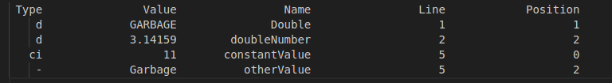

# Analyzer
________________________

## Overview

 *Analyzer is a program that reads from a text file containing declarations assignments and writes the corresponding information to another file.*


## Usage

1. ### Input file
> *The input file must contain declarations and assignments in the correct format (exp. const int val; bool flag = true; etc.)*
> 
> *They must be separated by a semicolon*
> 
> *The expression which is not declaration*
> 
> *An expression that is not a declaration is considered a variable whose information is written to the file*
>
>`````
> int Integer; double Double; char Character; float Float; short Short; bool Boolean;
> unsigned int integerNumber = 10; Double; double doubleNumber = 3.14159;
> unsigned char character = 'A'; unsigned float floatNumber = 2.71828f; unsigned short shortNumber = 1000;
> doubleNumber; unsigned bool boolean = true;  long long int result; long int sum;
> const int constantValue = 11;   constantValue; otherValue
>`````
> 
2. ### Instalation
> #### Clone with this link
> 
https://github.com/KimaKhachatryan/VisualCompiler_FirstTask.git
>
> * Us it in your main.cpp
> 
>> *include analyzer.h header file*
>> 
>> *declare analyzer object (which is functor) with your file name*
>> 
>> *then just call it*
>>
>>```````
>> analyzer obj{Filename};
>> obj();
>>```````
>
> #### Compile it
>	 
> * In your terminal command line write
>>
>>`````
>> g++ main.cpp -o MyProgName
>>`````
>
> * You will get 2 files
>	
>> *typeinfo.txt -> contains all posible declarations*
>> 
>> *result.txt -> contains information table*
>>
>>
>>
	


